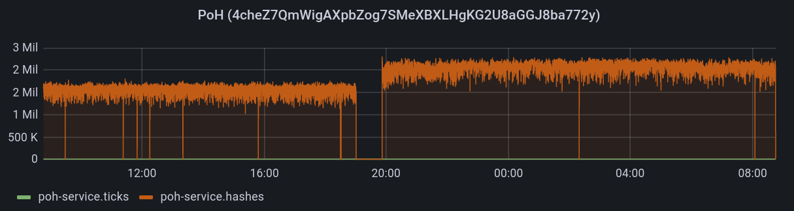
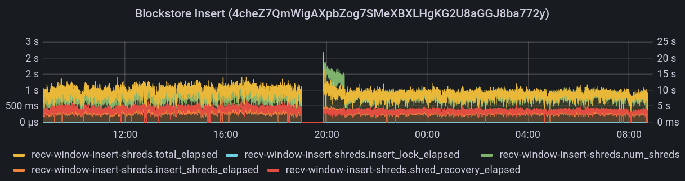
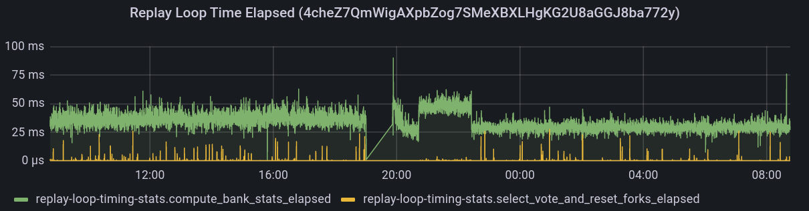
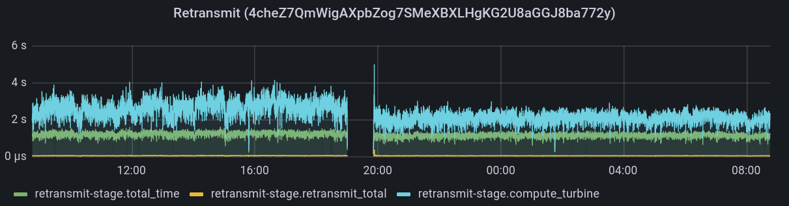

# News
**4/11/22** We are back online after some extended downtime due to changes in the Solana network. We are going to continue to evaluate and adapt our strategy to provide the most value. Thank you for your patience and understanding as we navigate these challenges together 🐈

**4/2/22** Hey everyone, Pumpkin's Pool underwent a major CPU upgrade yesterday! You can check our Discord server for more info, but everything is looking *really* good. The epoch timing was a little unfortunate with respect to our metrics, but the sooner we bit the bullet on this, the better. We want to be producing as many blocks as possible to produce the greatest amount of rewards, and the old hardware just wasn't cutting it. It wasn't a question of if it needed to be upgraded, it was a question of when. We're now looking better than ever.

The future holds two other major upgrade events, but these aren't planned for any time soon yet. When these events *do* happen, it will put as at virtually (or perhaps literally) zero downtime, and prevent hardware failure from even taking us down. There are a lot of exciting things on the horizon, so stay tuned. We're just getting started 🐈
